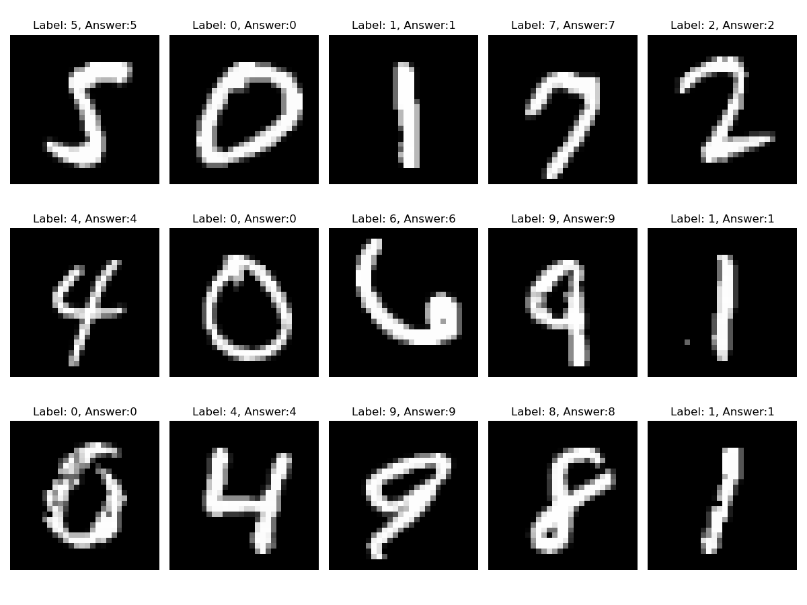
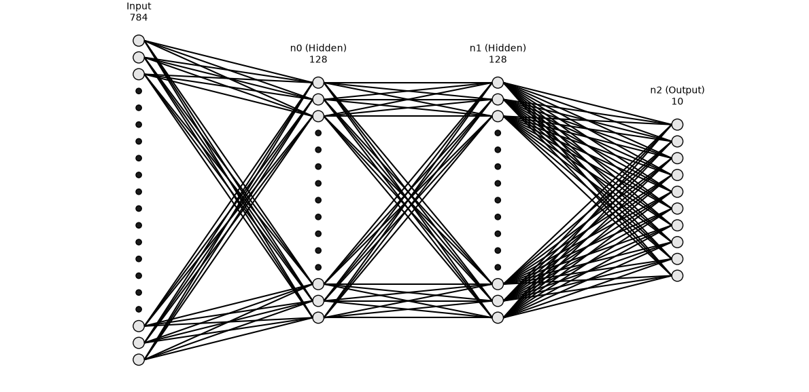
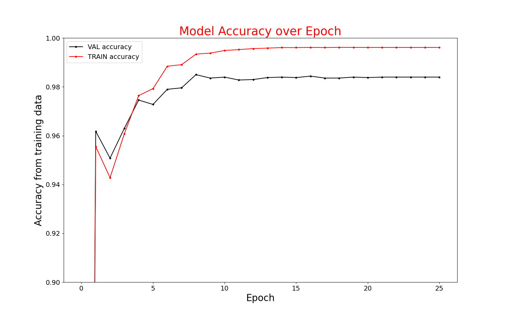
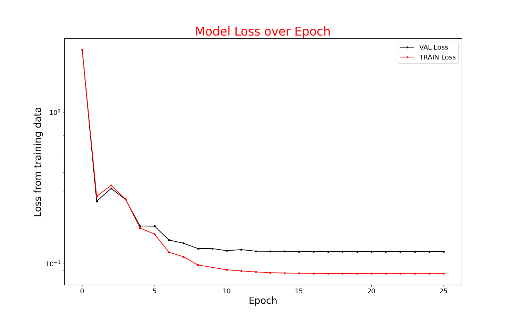

# Deep Learning: MNIST Image Recognition
A generic Deep Learning neural network designed to take in a MNIST image (28 x 28 pixel images of handwritten digits) and return which one it concluded it is based on Machine Learning algorithms. All the computation reflects hand-written formulas and has simply been vectored with Numpy for efficiency. No framework has been used.
## Network Structure

The very first layer isn't made of neurons, but represents one pixel of each image ($28\times28=784$). The value of each input is determined by the brightness of each pixel: 0 means completely black, 255 completely white, and the shade of grey are computed as intermediate values.

The core components of the network are three neuron layers, two of which are hidden and one is the output layer, i.e. the one holding the answer the network gives to the question "what's that number?". The length of the hidden layers have been chosen to hold enough complexity (a value large enough) while being easy to compute (power of 2). Each neuron holds a bias, and each connection between two neurons holds a weight, these are the parameters which are being updated at each passage of data through the network, and they determine its success. The biases have been initialised at 0 and the weights with $He$ initialisation as it has been shown to be very effective when paired with $ReLU$ activation.

On top of these, global variables have been added to support these algorithms which helped improve the networks accuracy:
- L2 Regularisation  : introduces $\lambda$ which penalises the weights on back propagation to ensure they don't diverge too much and reach very high values while avoiding over-fitting to the training data 
- Learning Rate Decay : introduces "decay_rate" and "decay_steps" which reduce the learning rate of the network over time to converge more quickly and avoid noise
- Adam : introduces $\beta_{1}$ , $\beta_2$  , $\varepsilon$ which adapt the learning rate per-parameter using running estimates of the gradient's mean and variance, allowing to push past low proxima of the gradient function

## Results

**The algorithm reaches 98.20% accuracy** on the test dataset ($\sigma=0.06$ at $n=30$ ), the gradients have been verified via central-difference check (cf gradient_check.py), max_relative_error < $1\times10^{-7}$ which is far below the acceptable threshold. The seed used to create the graphs has been pinned in the code for reproducibility. The model even goes up to 99.60% against the training dataset, but some overfitting is expected and has been optimised with L2 penalty.
The algorithm had already reached 96% accuracy before Adam / LR Decay / L2 penalty were even introduced, showing that the back propagation logic is very solid, and that the training data is very well standardised and homogeneous.
The current model performs better than a simple Pytorch equivalent (cf pytorch_benchmark.py) by a margin of 0.30% which is statistically significant and shows the optimisation of the current model. It still underperforms compared to state of the art CNN which can exceed 99.50%.


On this log scale, we can see loss decreasing from around $2.4$, which is coherent with a random initialisation, and goes down to $1.2\times10^{-1}$ for both the validation and the testing set, and $8.6\times10^{-2}$ for the training set which reflects that training has been about lowering as much as we can the loss of the training set.
## Calculation Details
***Forward Propagation Equations***
\
Forward propagation uses the very common  computation equation:
$\hat{Z} =XW^{T}+B$
where $\hat{Z}$ is the output of the matrix multiplication of $X$(the input layer) and $W$(the weights connecting this layer to the next) which has to be transposed $W^{T}$ to fit the matrix multiplication constraints. Then a matrix addition is performed between this product and the $B$(the biases of the destination layer).
To obtain the activation value of each neuron, we need to pass this intermediate result through an activation function :
$a =ReLU(\hat{Z})$  for the two hidden layers, and $a =SoftMax(\hat{Z})$ for the output layer.
\
***Back Propagation Equations***
\
To compute back propagation, we must first apply the Gradient Descent partial derivative formula and apply it to our specific case (ReLU and Soft-Max activation) in order to get the initial Cost signal of the output layer, which will be used to compute the cost of the parameters attached to it, and propagated via the transposed weight matrix.
So, the standard function :
$\dfrac{\partial C}{\partial w^{(L)}} =\dfrac{\partial z^{(L)}}{\partial w^{(L)}} \cdot \dfrac{\partial a^{(L)}}{\partial z^{(L)}} \cdot \sum_{k=1}^{n^{L+1}}\dfrac{\partial C}{\partial a_{k}^{(L+1)}}$

In practice becomes:

$$
\nabla_w C = \begin{bmatrix}
\text{vec}\left(\dfrac{\partial C}{\partial w^{(n_0)}}\right) \\
\text{vec}\left(\dfrac{\partial C}{\partial w^{(n_1)}}\right) \\
\text{vec}\left(\dfrac{\partial C}{\partial w^{(n_2)}}\right)
\end{bmatrix}
$$

with:

$$\dfrac{\partial C}{\partial w^{(n_0)}} = a_i^{(\text{input})} \cdot \text{ReLU}'(z_j^{(n_0)}) \cdot \sum_k \left[ w_{jk}^{(n_1)} \cdot \text{error}_k^{(n_1)} \right]$$

$$\dfrac{\partial C}{\partial w^{(n_1)}} = a_i^{(n_0)} \cdot \text{ReLU}'(z_j^{(n_1)}) \cdot \sum_k \left[ w_{jk}^{(n_2)} \cdot \text{error}_k^{(n_2)} \right]$$

$$\dfrac{\partial C}{\partial w^{(n_2)}} = a_i^{(n_1)} \cdot (\hat{y}_j - y_j)$$

and

$$
\nabla_b C = \begin{bmatrix}
\dfrac{\partial C}{\partial b^{(n_0)}} \\
\dfrac{\partial C}{\partial b^{(n_1)}} \\
\dfrac{\partial C}{\partial b^{(n_2)}}
\end{bmatrix}
$$

with:

$$\dfrac{\partial C}{\partial b^{(n_0)}} = \text{ReLU}'(z_j^{(n_0)}) \cdot \sum_k \left[ w_{jk}^{(n_1)} \cdot \text{error}_k^{(n_1)} \right]$$

$$\dfrac{\partial C}{\partial b^{(n_1)}} = \text{ReLU}'(z_j^{(n_1)}) \cdot \sum_k \left[ w_{jk}^{(n_2)} \cdot \text{error}_k^{(n_2)} \right]$$

$$\dfrac{\partial C}{\partial b^{(n_2)}} = \delta^{(n_2)}_j = \hat{y}_j - y_j$$

finally:

$$
\nabla_\delta C = \begin{bmatrix}
\delta^{(n_0)} \\
\delta^{(n_1)} \\
\delta^{(n_2)}
\end{bmatrix}
$$

with:

$$\delta^{(n_0)}_j = \sum_k \left[ w_{jk}^{(n_1)} \cdot \text{error}_k^{(n_1)} \right]$$

$$\delta^{(n_1)}_j = \sum_k \left[ w_{jk}^{(n_2)} \cdot \text{error}_k^{(n_2)} \right]$$

$$\delta^{(n_2)}_j = \hat{y}_j - y_j$$

## How to use
Move to the directory where you cloned the repo and install libraries you'll need in your virtual environment :
```bash
pip install .
```
\
**Reproducing the Results**
The seed used to produce the graphs has been pinned, you only have to run the main.py module :
```bash
python3 main.py
```
which will train the model, ask you to export the parameters, and produce both graphs. Then you can run test_network.py which will automatically use the model you exported, run it against a random sample in the TEST dataset, and produce the graph on top of the page with the label the model predicts for the digit, and the actual answer next to it.
NB : the first launch of main.py will download the database (~50mb) then use it automatically.
\
**Footnotes**
\
*on the use of AI*
AI has been used in this project to write gradient_check.py as it is a small module producing only one value for the project. Otherwise it has only been used as a debugging tool, all of the code has been written manually.
\
*special thanks*
The network graph has been produced using the fantastic pydrawnet of nhansen, I thank him for his work. 
I'd also like to thank the host of the channel 3blue1brown, whose videos I've watched tirelessly to try and understand the task at hand.
